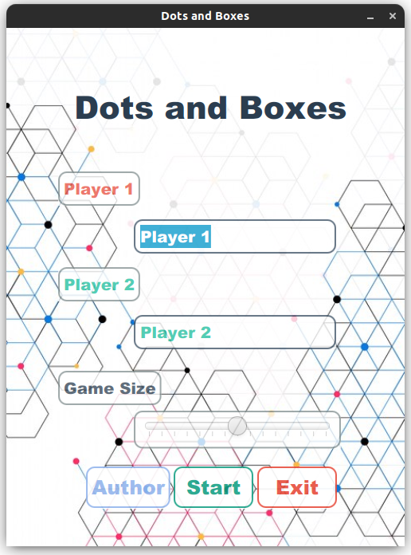
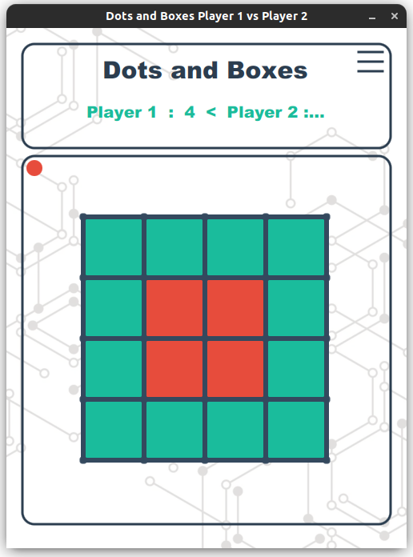

# Dots And Boxes Project
Dots and boxes Game java &amp; javafx

### Description
**Dots and Boxes** Game is a popular and simple game

The game is created in **Java** language with the use of **Java FX** library

### Tree Diagram

├── DotsAndBoxesProject.iml\
├── mvnw\
├── mvnw.cmd\
├── pom.xml\
├── README.md\
├── src\
│   └── main\
│       ├── java\
│       │   ├── com\
│       │   │   └── project\
│       │   │                └── example\
│       │   │                   └── dotsandboexsproject\
│       │   │                               ├── Author.java\
│       │   │                               ├── Board.java\
│       │   │                               ├── checkBox.java\
│       │   │                               ├── Game.java\
│       │   │                               ├── Lines.java\
│       │   │                               ├── MenuBoard.java\
│       │   │                               ├── Player.java\
│       │   │                               ├── Sound.java\
│       │   │                               └── Tile.java\
│       │   └── module-info.java\
│       └── resources\
│           ├── Images\
│           │      ├── backgroundAuthor.png\
│           │      ├── backgroundGame.png\
│           │      ├── menuBackground.png\
│           │      ├── preview_game.png\
│           │      └── preview_menu.png\
│           └── sound\
│                   ├── startGame.wav\
│                   ├── winBox.wav\
│                   └── winGame.wav\

### Menu

### Game Board

### Programmer
**Dots and Boxes** Game was created by **[Mahdi Khosravi](https://t.me/HzZz_Mahdi_zZzH)**